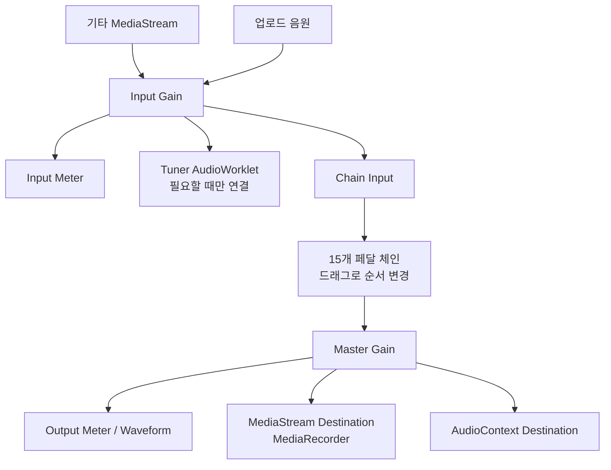

# Guitar Pedalboard

> [!CAUTION]
> **하울링은 청력과 스피커를 손상시킬 수 있습니다. 처음 연결할 때는 반드시 유선 헤드폰을 사용하고, 입력 게인과 마스터 볼륨을 낮춘 상태에서 천천히 올리세요.** 오디오 인터페이스의 Direct Monitor가 켜져 있으면 원음과 처리음이 동시에 들릴 수 있습니다.

Web Audio API로 동작하는 반응형 웹 기타 멀티 이펙터입니다. 설치 없이 브라우저에서 기타 입력 또는 음원 파일을 불러와 15개 이펙터의 순서와 파라미터를 조절하고, 프리셋 비교·튜닝·MIDI 풋스위치 제어·마스터 출력 녹음을 사용할 수 있습니다.

## 데모

- [GitHub Pages 데모](https://kimyounggaur.github.io/Guitar-Pedalboard/)

마이크 입력, AudioWorklet, Web MIDI는 보안 컨텍스트가 필요하므로 배포 환경에서는 HTTPS를 사용해야 합니다.

## 지원 브라우저

| 환경 | 지원 수준 | 참고 |
| --- | --- | --- |
| 최신 Chrome / Edge 데스크톱 | 권장 | Web Audio, AudioWorklet, MediaRecorder, Web MIDI, PWA 기능 사용 가능 |
| Firefox 데스크톱 | 기본 기능 | Web MIDI 등 일부 기능은 브라우저 지원 여부에 따라 UI가 숨겨지거나 비활성화됨 |
| Safari 데스크톱 | 기본 기능 | 오디오 장치 선택, 녹음 형식, Web MIDI 지원 범위를 실제 환경에서 확인 권장 |
| iOS Safari / Android Chrome | 톤 확인용 | 모바일 입력 지연과 장치 선택 제약 때문에 실시간 연주보다 음원 파일 모드를 권장 |

지원하지 않는 API는 앱 전체 오류로 이어지지 않으며, 해당 기능만 숨기거나 비활성화합니다.

## 권장 하드웨어

- Hi-Z(Instrument) 입력을 지원하는 USB 오디오 인터페이스
- 유선 헤드폰 또는 오디오 인터페이스의 헤드폰 출력
- 48 kHz를 안정적으로 처리할 수 있는 데스크톱/노트북
- 선택 사항: CC 또는 Note 메시지를 보내는 USB MIDI 풋컨트롤러

기타를 PC의 일반 마이크 입력에 직접 연결하면 임피던스 불일치, 노이즈, 레벨 부족이 생길 수 있습니다.

## 로컬 실행

Node.js 20 이상을 권장합니다.

```bash
npm install
npm run dev
```

프로덕션 빌드와 미리보기:

```bash
npm run typecheck
npm run lint
npm run build
npm run preview
```

기능별 회귀 스크립트는 `package.json`의 `test:*` 명령으로 실행할 수 있습니다.

## 아키텍처 개요



각 페달은 `BaseEffect`의 dry/wet, makeup gain, level, true-bypass 경로를 공유합니다. 순서 변경은 짧은 마스터 페이드와 연결 차이 적용으로 처리하고, Delay/Reverb의 trails는 바이패스 뒤에도 자연스럽게 감쇠합니다. Noise Gate, Auto Wah envelope follower, Tuner는 AudioWorklet에서 처리하며 Reverb IR은 Worker와 캐시를 사용해 생성합니다.

## 이펙터와 파라미터

모든 페달은 공통으로 Mix, Level, On/Off, Bypass를 가집니다.

| 이펙터 | 주요 파라미터 | 범위 또는 선택지 |
| --- | --- | --- |
| Noise Gate | Threshold, Attack, Hold, Release/Decay, Hysteresis | -80~-20 dB, 1~50 ms, 0~300 ms, 20~1000 ms, 0~10 dB |
| Compressor | Threshold, Ratio, Attack, Release, Knee/Tone, Sustain | -60~-10 dB, 1:1~20:1, 0~1 s, 0~1 s, 0~40 dB, 0~100% |
| Auto Wah | Sensitivity, Range, Resonance, Mode, Manual | 0~100%, Auto/Manual |
| Drive | Mode, Drive, Tone, Bias | Overdrive/Crunch/Distortion/Fuzz, 0~100%, -1~1 |
| Crunch | Gain, Tone, Presence, Low Cut, Volume | 0~100%, 40~400 Hz, 0~160% |
| Fuzz | Mode, Fuzz, Tone, Bias, Gate, Low Cut | 3 modes, 0~100%, 40~400 Hz |
| Graphic EQ | 100/200/400/800 Hz, 1.6/3.2/6.4 kHz | 각 -12~+12 dB |
| EQ | Low Cut, Bass, Mid Freq/Gain/Q, Treble, Presence | 20~400 Hz, gain ±12 dB, Q 0.3~4 |
| Cab | Model, Mic Position, Distance, Low/High Cut, Presence | 5 models+Off, 0~100%, 40~200 Hz, 3~12 kHz, ±6 dB |
| Chorus | Rate, Depth, Voices, Spread, Tone | 0.1~8 Hz, 0~100%, 2/3/4 voices |
| Flanger | Rate, Depth, Feedback, Manual | 0.05~5 Hz, 0~100%, -95~95%, 0.5~10 ms |
| Phaser | Rate, Depth, Stages, Feedback | 0.05~8 Hz, 0~100%, 4/6/8/12 stages, 0~90% |
| Tremolo | Rate, Depth, Shape, Sync, Division | 0.5~20 Hz, Sine/Triangle/Square, 40~240 BPM |
| Delay | Mode, Time, Feedback, Tone, Sync, Division, Trails | 5 modes, 20~2000 ms, 0~95%, 40~240 BPM |
| Reverb | Mode, Decay, Pre Delay, Low/High Cut, Trails | 5 modes, 0.2~6 s, 0~250 ms, 20~500 Hz, 1~12 kHz |

## 주요 기능

- 40개 팩토리 프리셋과 사용자 프리셋 저장·가져오기·내보내기
- A/B 프리셋 슬롯과 탭 템포
- Standard, Drop D, Half Step Down, Open G 튜닝
- MIDI 우클릭 학습: CC 0~63=Off, 64~127=On 및 Note On/Off
- 마스터 출력 WebM 녹음과 다운로드
- 키보드 단축키: `1`~`9`, `Space`, `T`, `A`, `B`, `Esc`, `?`
- 키보드 센서를 포함한 페달 순서 변경
- 입력/출력 RMS·peak, 클리핑 텍스트, 파형, 지연시간, 실제 오디오 글리치 카운터

## 알려진 제약

- 모바일 브라우저는 보통 입력 지연이 크고 오디오 장치 선택이 제한적입니다. 실시간 연주에는 PC와 오디오 인터페이스를 권장합니다.
- 오프라인에서는 앱 셸과 이미 캐시된 리소스를 열 수 있지만 `getUserMedia` 기타 입력은 사용할 수 없습니다. 로컬 음원 파일로 톤을 확인하세요.
- Web MIDI는 지원 범위가 제한적이며 HTTPS와 사용자 권한이 필요합니다. 미지원 브라우저에서는 MIDI UI가 표시되지 않습니다.
- 브라우저와 운영체제에 따라 실제 입출력 지연, 사용 가능한 장치명, MediaRecorder 코덱이 달라집니다.
- 웹 오디오만으로 운영체제 드라이버 버퍼 크기를 직접 제어할 수 없습니다.
- 실제 기타·오디오 인터페이스·헤드폰을 사용한 청감 및 하울링 검증은 자동 테스트로 대체할 수 없습니다.

## 라이선스

애플리케이션 코드는 [MIT License](./LICENSE)로 배포됩니다.

`Source/` 폴더의 스톡 이미지, 제품 사진, 참고 이미지는 배포 번들에 포함되지 않는 로컬 참고 자료입니다. 해당 자산을 재사용하거나 재배포하기 전에는 원저작자의 라이선스와 상표 사용 권한을 별도로 확인해야 합니다.
